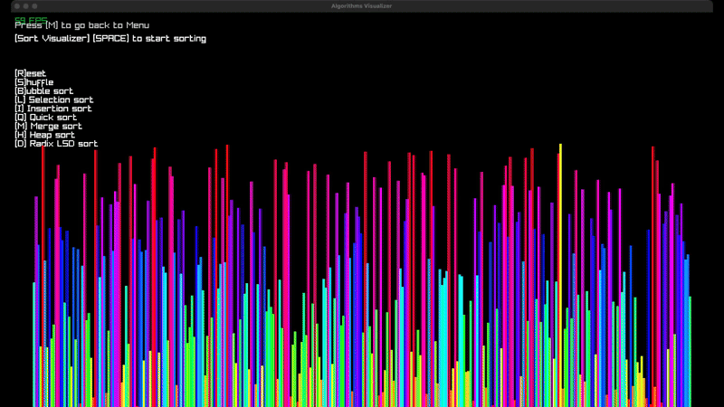
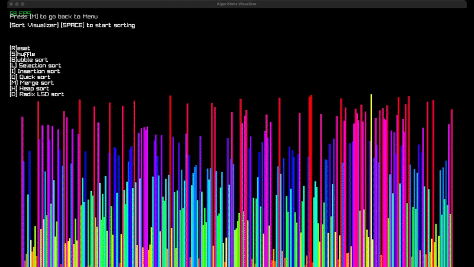
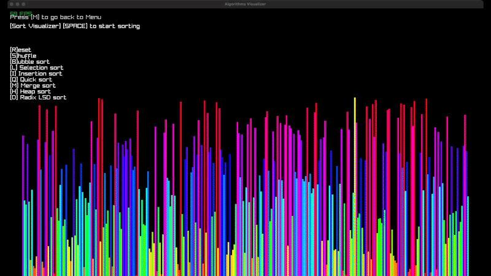
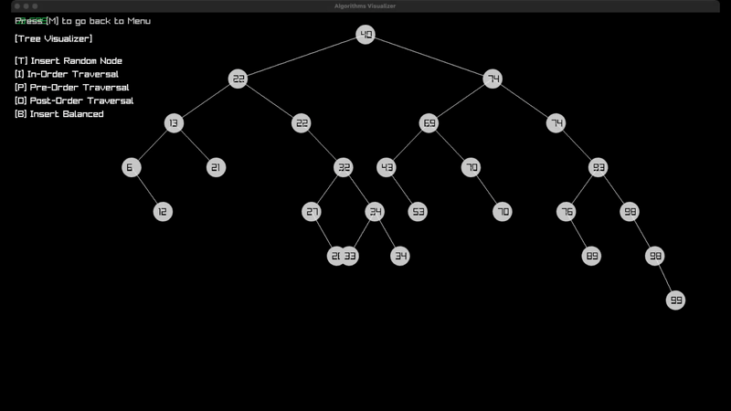
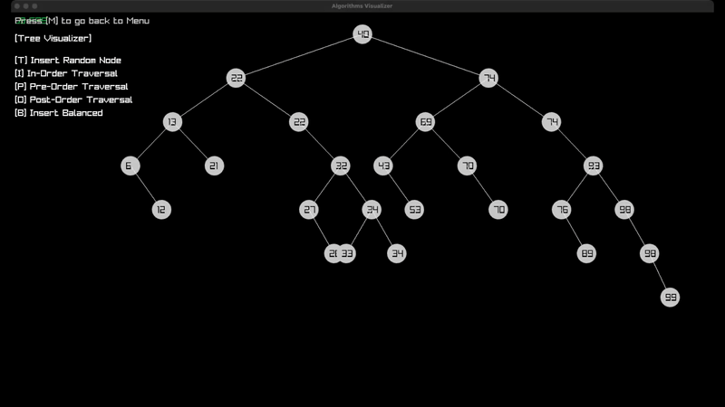
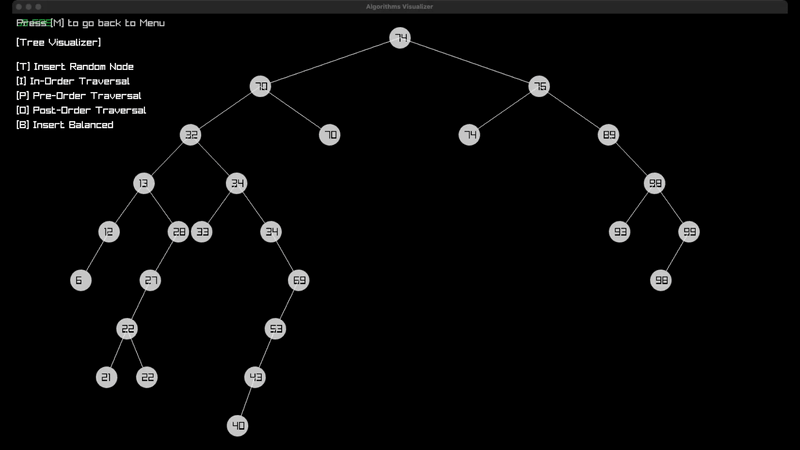
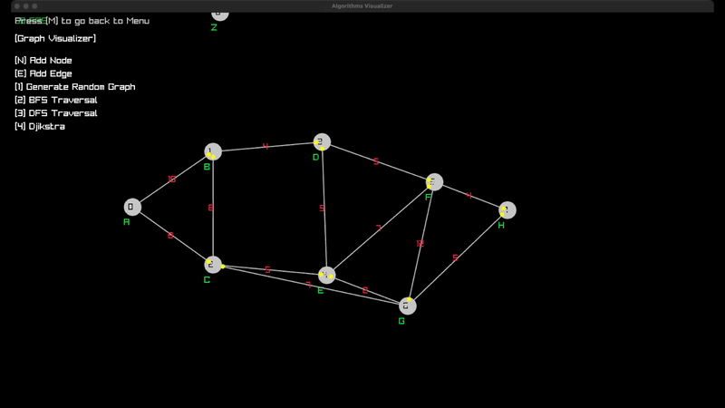
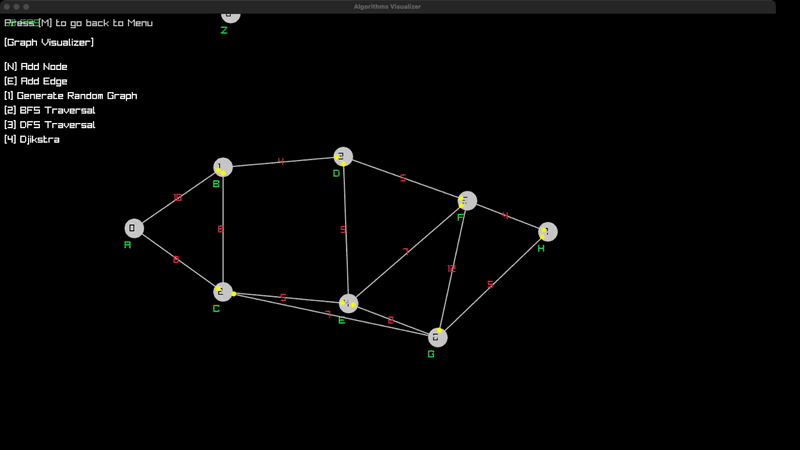

# Proyecto de Algoritmos

Visualizador de algoritmos de ordenamiento

## Instalacion

### Windows

Este proyecto usa [raylib](https://www.raylib.com/) para dibujar en pantalla, asi que asegurese de tenerlo instalado.
Despues clone el repositorio

```sh
git clone https://github.com/matwate/Proyecto-Algoritmos.git
```

Despues de clonarlo encontrara un archivo `main.code-workspace`, abralo en vscode y oprima el boton `open workspace`

Una vez eso ya puede ejecutar el programa con `F5`

### Linux/MacOS

1. Clona el repositorio y navega al directorio principal:
    ```bash
    git clone <url-del-repositorio>
    cd visualizador-algoritmos
    ```

2. Compila el proyecto utilizando **Makefile**:
    ```bash
    make
    ```

3. Ejecuta la aplicación:
    ```bash
    make run
    ```

---

## Caracteristicas

- **Visualización algoritmos de ordenamiento**:

  - Insertion Sort
  - Selection Sort
  - Bubble Sort
  - Quick Sort
  - Merge Sort
  - Heap Sort
  - Radix LSD Sort
  - Bogo Sort.

  Y se puede cambiar el tamaño del arreglo sobre el cual Bogo Sort trabaja.

- **Visualización de árboles**: Inserciones, recorridos (inorden, preorden, posorden), y balanceo.
- **Exploración de grafos**: BFS, DFS, Dijkstra, y generación de grafos aleatorios.

---

## Demos

### Algoritmos de Ordenamiento

#### Bubble Sort


#### Heap Sort


#### Insertion Sort


#### Quick Sort


#### Radix Sort (LSD)


#### Selection Sort


---

### Visualización de Árboles

#### Inserción de Nodo Aleatorio


#### Recorrido Inorden


#### Recorrido Preorden


#### Recorrido Posorden


#### Balanceo del Árbol


---

### Visualización de Grafos

#### Búsqueda BFS


#### Búsqueda DFS


#### Algoritmo de Dijkstra


#### Generación de Grafo Aleatorio


#### Creación de Grafo Personalizado


---

## Contributing

Pull requests are welcome. For major changes, please open an issue first
to discuss what you would like to change.

Please make sure to update tests as appropriate.

## License

[MIT](https://choosealicense.com/licenses/mit/)
